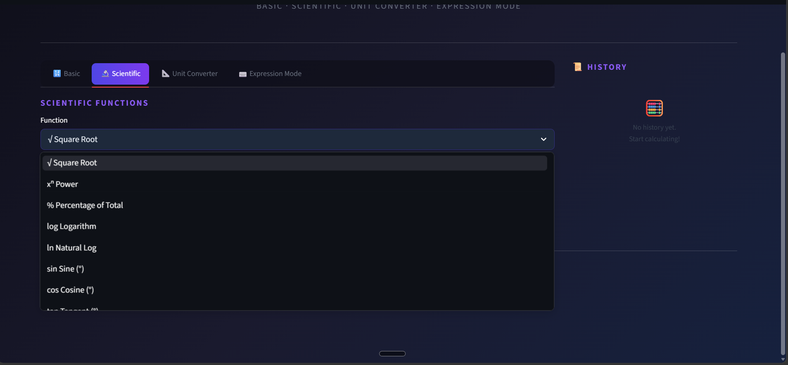
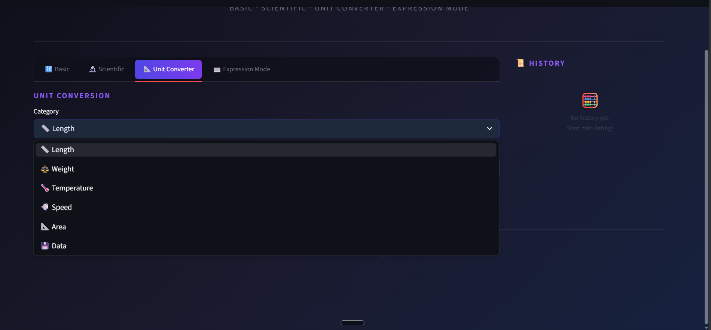
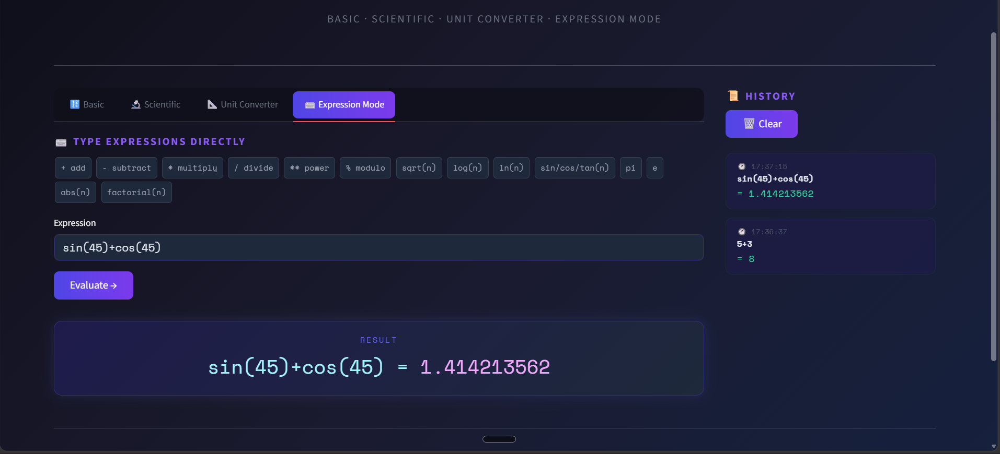

# 🧮 SmartCalc Pro

A professional, feature-rich web calculator built with **Python** and **Streamlit**.  
Goes far beyond a basic calculator — includes scientific functions, unit conversion, expression mode, and calculation history.


---

## ✨ Features

| Feature | Description |
|---|---|
| **Basic Calculator** | Addition, Subtraction, Multiplication, Division |
| **Division by Zero Handling** | Friendly error messages instead of crashes |
| **Scientific Mode** | √, xⁿ, %, log, ln, sin, cos, tan, n! |
| **Unit Converter** | Length, Weight, Temperature, Speed, Area, Data |
| **Expression Mode** | Type full expressions with keyboard shortcuts |
| **Calculation History** | Logs all calculations with timestamps (newest first) |
| **Dark Theme UI** | Professional dark UI with gradient accents |

---

## ⌨️ Keyboard Shortcuts (Expression Mode)

| Input | Operation |
|---|---|
| `+` | Addition |
| `-` | Subtraction |
| `*` | Multiplication |
| `/` | Division |
| `**` | Power |
| `%` | Modulo |
| `sqrt(n)` | Square root |
| `log(n)` | Log base 10 |
| `ln(n)` | Natural log |
| `sin(n)`, `cos(n)`, `tan(n)` | Trig (degrees) |
| `factorial(n)` | Factorial |
| `pi`, `e` | Constants |

---

## 🗂️ Project Structure

```
smartcalc_pro/
├── app.py                    # Main Streamlit application
├── requirements.txt          # Dependencies
└── calculator/
    ├── __init__.py
    ├── basic_ops.py          # +, -, ×, ÷ with error handling
    ├── scientific_ops.py     # Advanced math functions
    └── unit_converter.py     # Multi-category unit conversion
```

---

## 🛠️ Tech Stack

- **Python 3.10+**
- **Streamlit** — Web UI framework
- **math** (standard library) — Scientific functions
- Modular package architecture

---

## 📦 Getting Started

### 1. Clone the repository
```bash
git clone https://github.com/kvsajith34/Codveda_Technologies.git
cd B-Task1-Smart_Calculator
```

### 2. Create a virtual environment
```bash
python -m venv venv

# Activate (Windows)
venv\Scripts\activate

# Activate (macOS/Linux)
source venv/bin/activate
```

### 3. Install dependencies
```bash
pip install -r requirements.txt
```

### 4. Run the app
```bash
streamlit run app.py
```

App opens automatically at **http://localhost:8501**

---

## 🧪 Error Handling

- ✅ Division by zero → clear user-facing error message
- ✅ Square root of negative numbers → caught with `ValueError`
- ✅ Factorial of non-integers / negatives → validated before computation
- ✅ Expression mode → sandboxed `eval()` with safe namespace (no `__builtins__`)
- ✅ Log of zero or negative → explicit validation

---

## 📸 Screenshots

>
>
>
>
---

## 🏆 Internship Context

This project was built as part of the **Codveda Technology Python Developer Internship**.

- **Level:** 1 (Basic)
- **Task:** 1 — Simple Smart Calculator
- **Enhancements:** Scientific mode, Unit conversion, Expression evaluator, History logging

---


## 📝 License

MIT License — feel free to fork, modify, and build upon this project.

---

*Built using Python & Streamlit*
